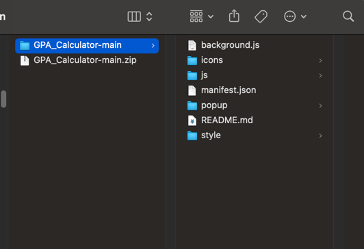
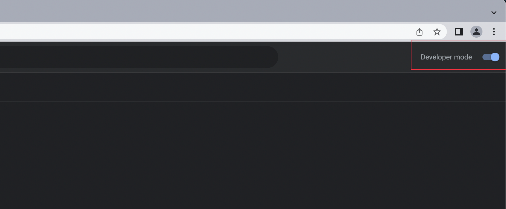

# GPA Calculator for TMU

A extension for congdaotao.tmu.edu.vn to display gpa on site.

## Download

[Download extension](https://github.com/vieanhng/GPA_Calculator/archive/refs/heads/main.zip)

## Installation

Google Chrome / Microsoft Edge (Custom sites supported)

1. Download this repo as a [ZIP file from GitHub](https://github.com/vieanhng/GPA_Calculator/archive/refs/heads/main.zip).
2. Unzip the file

3. In Chrome/Edge go to the extensions page (chrome://extensions or edge://extensions).
4. Enable Developer Mode.
- Microsoft Edge

- Google Chrome

5. Drag the folder you have unziped anywhere on the page to import it (do not delete the folder afterwards).

6. Login to congdaotao.tmu.edu.vn 
## Screeenshot
Result:

## Authors

- [@vieanhng](https://www.github.com/vieanhng)

## License

[MIT](https://choosealicense.com/licenses/mit/)

