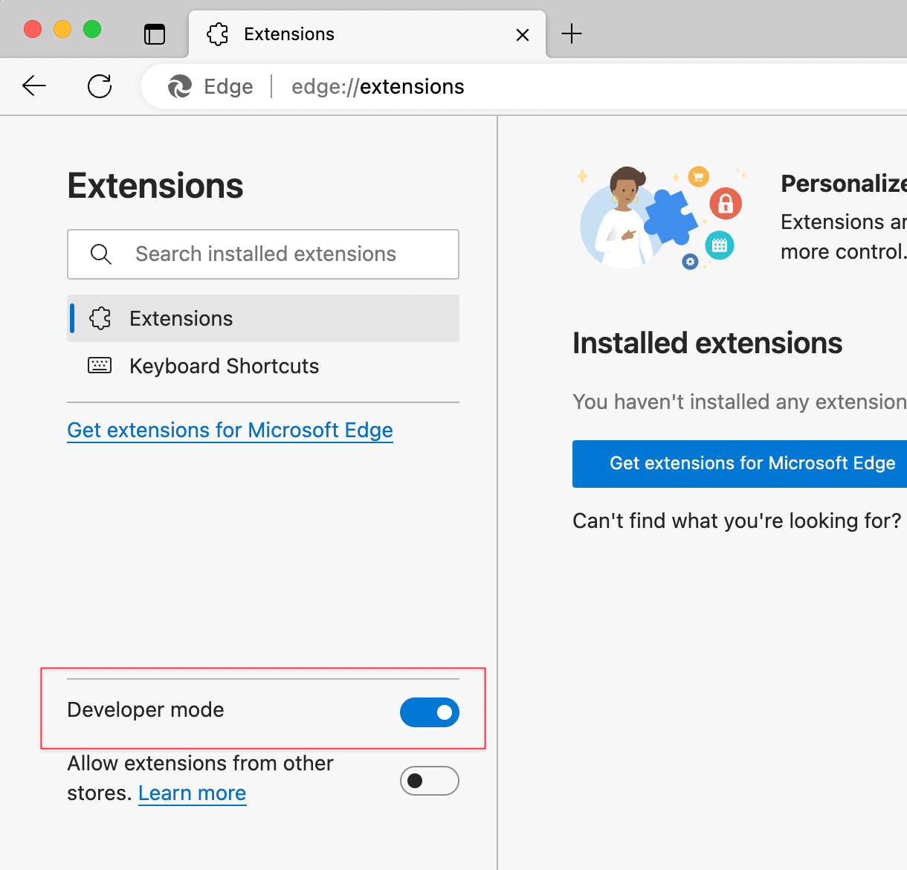

# GPA Calculator for TMU

Tiện ích hiển thị GPA trên trang congdaotao.tmu.edu.vn
A extension for congdaotao.tmu.edu.vn to display gpa.

## Chức năng
Tính điểm GPA dựa trên điểm hiện có trong danh sách Kết quả học tập.
 
Đã loại trừ các điểm không nằm trong GPA như các học phần thể chất và một số học phần kh tuỳ theo từng khoa. 

## Download

[Download extension](https://github.com/vieanhng/GPA_Calculator/archive/refs/heads/main.zip)

## Cài đặt

Google Chrome / Microsoft Edge (Custom sites supported)

1. Tải xuống repo này dưới dạng tệp [ZIP file từ GitHub](https://github.com/vieanhng/GPA_Calculator/archive/refs/heads/main.zip).
2. Giải nén file  

3. Trong trình duyệt Chrome/Edge, truy cập trang phần mở rộng (chrome://extensions or edge://extensions).
4. Kích hoạt chế độ Developer Mode.
- Microsoft Edge  

- Google Chrome  

5. Kéo thư mục bạn đã giải nén vào bất cứ đâu trên trang để nhập nó (không xóa thư mục sau đó).  

6. Đăng nhập vào congdaotao.tmu.edu.vn (Nếu chưa thấy hiện GPA thì bạn thử reload lại page nhe!!)
## Screeenshot
Result:  

## Installation

Google Chrome / Microsoft Edge (Custom sites supported)

1. Download this repo as a [ZIP file from GitHub](https://github.com/vieanhng/GPA_Calculator/archive/refs/heads/main.zip).
2. Unzip the file  

3. In Chrome/Edge go to the extensions page (chrome://extensions or edge://extensions).
4. Enable Developer Mode.
- Microsoft Edge  

- Google Chrome  

5. Drag the folder you have unziped anywhere on the page to import it (do not delete the folder afterwards).  

6. Login to congdaotao.tmu.edu.vn 
## Screeenshot
Result:  

## Authors

- [@vieanhng](https://www.github.com/vieanhng)

## License

[MIT](https://choosealicense.com/licenses/mit/)

